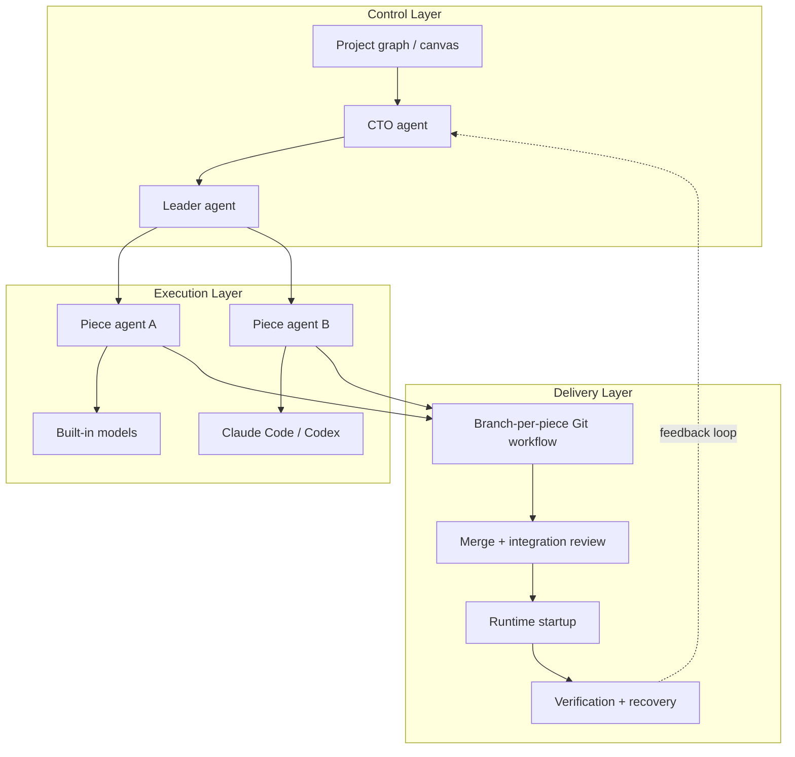

# Project Builder

*Map a software project as a system, hand work to AI agents, and push it all the way toward a running app.*

## Why I Built This

Most AI coding tools still feel like isolated prompts. I wanted to see the architecture, see how everything connects, break the project into pieces, let different agents handle different scopes, and keep the important decisions reviewable without the whole thing turning into prompt spaghetti. I wanted live documentation more like a real startup or tech company uses, so agent teams could share context and work together instead of constantly starting from scratch.

I also wanted more continuity than a normal AI workflow. I wanted teams of agents to stay attached to parts of a project, own their area, review each other's work, consult other teams when they needed context outside their lane, and keep long-running work structured, recoverable, and under control while I could still see what they were working with.

## What It Does

Project Builder lets me run a software project more like a startup or tech company than a chat thread. I can talk to a CTO-style agent that helps shape the project, split it into smaller teams that own different parts of the system, and route work to the right agents. Each team can use the models and coding agents that make sense for its part of the job, share context through the project itself, and keep the whole thing moving through planning, implementation, review, merge, runtime, and verification while I oversee what’s happening across the project.

Right now, the main flow looks like this:

- Create a repo-backed project from the app.
- Break it into pieces and connections on a visual canvas.
- Use the CTO chat to propose changes through reviewable action blocks.
- Turn the diagram into a structured work plan with the Leader agent.
- Run tasks one by one or sequentially.
- Detect, start, and verify the generated app from inside the desktop UI.

## Key Features

- Visual project graph with pieces, connections, responsibilities, interfaces, and constraints
- CTO-style chat with review-gated actions and decision history
- Leader-generated work plans with per-task runs and sequential execution
- Piece-level execution with built-in models or external coding agents like Claude Code and Codex
- Branch-per-piece Git workflow with auto-commit, merge, and integration review
- Prompt-to-delivery loop with runtime detection, startup, verification, retry, and recovery
- Project-wide visibility through delivery state, live agent activity, and execution status

## Architecture



The control layer shapes the project, the execution layer can mix models and coding agents across pieces, and the delivery layer turns that work into something merged, runnable, and verifiable.

## What Makes It Adaptive

- Different pieces can use different models and different coding agents in the same project.
- Review and autonomy policies can be tuned based on how much control you want.
- Runtime setup and validation are project-specific instead of hardcoded.
- The system keeps state, streams progress, and supports recovery instead of treating every run like a one-shot chat.

## What's Next

- [ ] Specialized implementation, testing, and review agents per piece
- [ ] Agent-to-agent coordination across teams
- [ ] Persistent agent processes with pause, resume, and crash recovery
- [ ] Project-wide monitoring and continuous operation

## Tech Stack

- Tauri + Rust
- React + TypeScript
- Vite + Tailwind CSS
- React Flow + Zustand
- SQLite
- Claude / OpenAI-compatible models, plus optional Claude Code and Codex execution that can be mixed across pieces

## Getting Started

### Prerequisites

- Node.js
- Rust
- Git

If you want to use external execution engines, you’ll also want `claude` and/or `codex` on your `PATH`.

### Install

```bash
make setup
```

That installs the frontend deps and fetches the Rust crates.

### Run the app

```bash
make dev
```

Useful alternatives:

```bash
npm run dev          # frontend only
make check           # TypeScript + Rust checks
make dev-session     # desktop dev run with captured logs
```

### API keys

The app stores provider keys in the OS keychain from the Settings screen. It also supports environment variable fallback:

- `ANTHROPIC_API_KEY`
- `OPENAI_API_KEY`
- `LLM_API_KEY`

Inside the container workflow, env vars are the safer bet than keychain integration.

### Container workflow

If you want the hybrid container setup that ships with the repo:

```bash
make container-up
make container-frontend
make host-tauri-dev
```

### First run

Create a project from the Projects screen, choose a parent folder, and the app will create a repo-backed working directory with an initial `main` commit for you.
