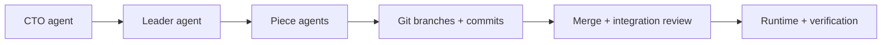

# Project Builder

*Map a software project as a system, hand work to AI agents, and push it all the way toward a running app.*

## Why I Built This

I wanted something that felt more like steering a small software team than prompting a chatbot. I wanted to see the architecture, break work into pieces, let different agents handle different scopes, keep the important decisions reviewable, and still have a clear path from "build this" to "okay, now run it and prove it works."

I also wanted a way to turn messy product intent into something structured, reviewable, and actually runnable.

## What It Does

Project Builder is a local-first orchestration system for AI-assisted software delivery.

You model a project as connected pieces on a canvas, chat with a CTO-style agent about changes, generate a work plan from the diagram, and run piece-level agents to do the implementation. Those runs can use the built-in LLM path or external tools like Claude Code and Codex, and different pieces can use different models and coding agents in the same project. The app streams output live, keeps history in SQLite, creates per-piece git branches, auto-commits successful runs, and shows the delivery path in one place.

Right now, the main flow looks like this:

- Create a repo-backed project from the app.
- Break it into pieces and connections on a visual canvas.
- Use the CTO chat to propose changes through reviewable action blocks.
- Turn the diagram into a structured work plan with the Leader agent.
- Run tasks one by one or sequentially.
- Detect, start, and verify the generated app from inside the desktop UI.

## Architecture



The CTO shapes the project, the Leader turns that into executable work, and each piece can run with its own model or coding agent before everything gets merged, reviewed, and verified.

## What Makes It Adaptive

- Different pieces can use different models and different coding agents in the same project.
- Review and autonomy policies can be tuned based on how much control you want.
- Runtime setup and validation are project-specific instead of hardcoded.
- The system keeps state, streams progress, and supports recovery instead of treating every run like a one-shot chat.

## Tech Stack

- Tauri + Rust
- React + TypeScript
- Vite + Tailwind CSS
- React Flow + Zustand
- SQLite
- Claude / OpenAI-compatible models, plus optional Claude Code and Codex execution that can be mixed across pieces

## Getting Started

### Prerequisites

- Node.js
- Rust
- Git

If you want to use external execution engines, you’ll also want `claude` and/or `codex` on your `PATH`.

### Install

```bash
make setup
```

That installs the frontend deps and fetches the Rust crates.

### Run the app

```bash
make dev
```

Useful alternatives:

```bash
npm run dev          # frontend only
make check           # TypeScript + Rust checks
make dev-session     # desktop dev run with captured logs
```

### API keys

The app stores provider keys in the OS keychain from the Settings screen. It also supports environment variable fallback:

- `ANTHROPIC_API_KEY`
- `OPENAI_API_KEY`
- `LLM_API_KEY`

Inside the container workflow, env vars are the safer bet than keychain integration.

### Container workflow

If you want the hybrid container setup that ships with the repo:

```bash
make container-up
make container-frontend
make host-tauri-dev
```

### First run

Create a project from the Projects screen, choose a parent folder, and the app will create a repo-backed working directory with an initial `main` commit for you.

## What's Next

- [ ] Persistent multi-agent teams with pause/resume and crash recovery
- [ ] Agent-to-agent coordination across pieces
- [ ] Richer live agent status and monitoring, not just running/failed
- [ ] 24/7 continuous operation for long-lived projects
